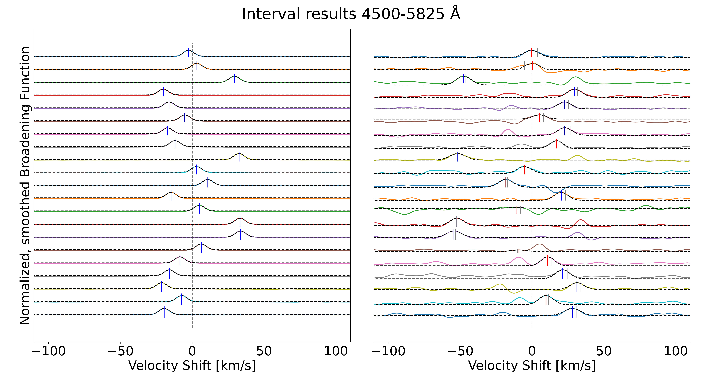
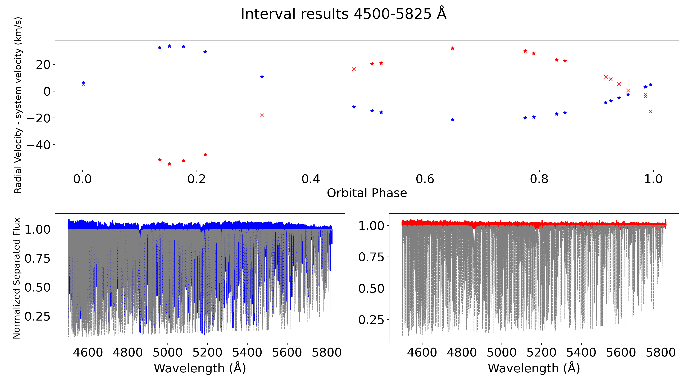

# Evaluating output
The `evaluate_ssr_results` module provides convenient ways to evaluate the raw data output from the spectral separation routine with similar plots to those provided during routine execution.

## Load data
To load the raw data from the routine, the function `load_routine_results` can be used:

Input arguments:
- **folder_path** (string). Provides the folder location of the raw output from the spectral separation routine.
- **filename_bulk_list** (list\[string, ...\]). This should contain a list of filename identifiers, specifically the identifying wavelength intervals. Examples of input: \['4500_5825'\] or \['4500_4625', '4625_4750'\]

Returns:
- **routine_results** (RoutineResults object). This object can be supplied to the other functions for convenient plotting.

## Plotting functions
`plot_broadening_functions()` input:
- evaluation_data (RoutineResults).
- block (bool), Default = False. If True, plt.show(block=True).
- xlim (list\[float, float\]), Default = None. If provided, plt.xlim(xlim).
- smoothed (bool), Default = True. If True, plots the smoothed broadening functions. If False, unsmoothed.

This function will create a single figure for each wavelength interval provided.

Example broadening function plot:

`plot_rv_and_separated_spectra()` input:
- evaluation_data (RoutineResults).
- period (float).
- block (bool), Default = False.
- color_A (string), Default = 'b'. Matplotlib colors.
- color_B (string), Default = 'r'.
- fig (matplotlib figure), Default = None. If provided, will overplot on the previously used figure.
- axs (list\[matplotlib axes\]), Default = None. If provided, will overplot on the previously used axes.

Returns: fig, ax1, ax2, ax3

Example rv plot:

